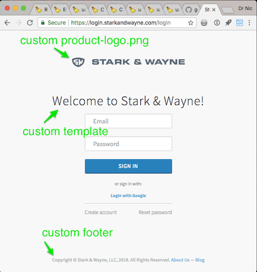
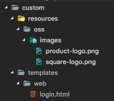

# Quaa - Quick UAA deployment with Cloud Foundry

This project is dedicated to making it easy to bring up a quick, secure, production-ready UAA on any Cloud Foundry, and to upgrade it in future.

This project is derived from UAA's own suggestions for how to run the UAA on Cloud Foundry, and the subcommands and operator files are designed to match the sister project for deploying UAA with BOSH, [quick-uaa-deployment](https://github.com/starkandwayne/quick-uaa-deployment).

The name of the helper application is `quaa`. This name matches the sister project's helper name. The aim is to have matching subcommands for common activities between the two projects.

## Deploy UAA to Cloud Foundry

To quickly bootstrap a secure, production-grade UAA to any Cloud Foundry:

First, clone this repo.

```plain
git clone https://github.com/starkandwayne/quick-uaa-deployment-cf ~/workspace/quick-uaa-deployment-cf
cd ~/workspace/quick-uaa-deployment-cf
```

If you have `direnv` installed, you will be asked to `direnv allow` and then you will see the dependent CLIs (`cf`, `uaa`, and `bosh`) downloaded into the `bin/` folder.

If you do not see this, instead manually source the `quaa env` output to preinstall the dependent CLIs into your local path:

```plain
eval "$(bin/quaa env)"
```

Using the `cf` CLI, target and login to your Cloud Foundry, and select an organization and space:

```plain
cf login -a https://api.run.pivotal.io --sso
cf create-space uaa-production
cf target -s uaa-production
```

Next, create a PostgreSQL or MySQL database called `uaa-db`:

```plain
# PostgreSQL on PWS
cf create-service elephantsql turtle uaa-db

# MySQL on PWS
cf create-service cleardb spark uaa-db
```

To generate secrets, encyption keys, certificates for your UAA, and deploy the UAA to your Cloud Foundry:

```plain
quaa up --route login.starkandwayne.com
```

Note, the `quaa up` command can be run in future to upgrade. The flags provided above will be cached in `vars.yml` and not be required to be provided again.

Once deployed, visit the UAA home page for users to login https://login.starkandwayne.com (for your route).

You can see the generated `uaa_admin` client secret, and complimentary `admin` user:

```plain
$ quaa info
```

To target and authorize the [`uaa` CLI](https://github.com/cloudfoundry-incubator/uaa-cli):

```plain
quaa auth-client

uaa clients
uaa users
uaa groups
```

To use the `quaa` and `uaa` CLIs anywhere, eval the `quaa env` output:

```plain
eval "$(~/workspace/quick-uaa-deployment-cf/bin/quaa env)"

uaa clients
uaa users
uaa groups
```

## Customize UAA

You can customize your UAA by applying operator files.

Customize the UAA itself by creating an `operators/uaa/` folder, and any `.yml` operator files in it will be automatically applied to your UAA YAML configuration during `quaa up`. See the [`ops-files/uaa/`](ops-files/uaa/) folder for more instructions and many production-ready operator files.

Customize the Cloud Foundry environment by creating an `operators/cf/` folder, and any `.yml` operator files in it will be automatically applied to your `cf push` configuration during `quaa up`. See the [`ops-files/cf/`](ops-files/cf/) folder for more instructions and many production-ready operator files.

### Modify theme



To modify the logos - the homepage logo and the square favicon logo - create a folder `custom/resources/oss/images` and place your own files into it:

```plain
custom/resources/oss/images
├── product-logo.png
└── square-logo.png
```

To modify the HTML templates - the login page, the home page, even the email templates - create a folder `custom/templates` and place your own override files into it:

```plain
custom/templates
└── web
    └── login.html
```

Your `custom/` folder might look like:



During `quaa up` a custom .war will be created and uploaded during `cf push`. See the [`bin/customize-uaa-war`](bin/customize-uaa-war) script for more details.

```plain
$ customize-uaa-war

  build      -- build new .war
  test       -- exit 0 if custom build exists, else exit 1
  init [dir] -- extract current theme into custom/ for modification (or alternate dir/)
```

## Create Users

For each staff member you can easily create a new UAA user:

```plain
uaa create-user drnic \
  --email drnic@starkandwayne.com \
  --givenName "Dr Nic" \
  --familyName "Williams" \
  --password drnic_secret
```

You can assign them to groups (which gives them access to authorized scopes):

```plain
uaa add-member uaa.admin drnic
```

## Upgrade UAA

To upgrade, pull the lastest commits from the `master` branch and run `quaa up` again.

```plain
cd ~/workspace/quick-uaa-deployment-cf
git pull
quaa up
```

## Destroy UAA

To tear down your UAA and its database:

```plain
quaa down
```
